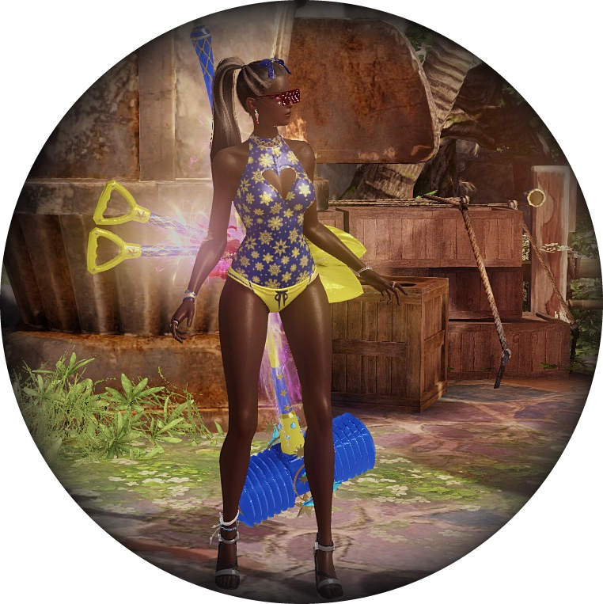

# Flipeador

I like watermelon 🍉

 

  ⠀
  ⠀
  ⠀
  ⠀
   ⠀
  ⠀
  

 

If you've been digging around through my repositories, you've probably noticed that I like to reinvent the wheel and write my own libraries. These are my reasons.

- When I use a library, I like to know what it does and how it actually works, and I also want to make sure it works exactly as I expect it to.
- Writing my own code feeds my knowledge and it gives me comfort to know that it is written following my own coding style.
- When I write my own libraries, I try to keep the code simple, lightweight and with as few dependencies as possible.
- I like up-to-date and efficient code, using the most modern features.

---

### 🛠 OS and Tools

  ⠀
  ⠀
  ⠀
  ⠀
  ⠀
  ⠀
  ⠀
  

---

### 🛠 Languages and Frameworks

  ⠀
  ⠀
  ⠀
  ⠀
  ⠀
  ⠀
  ⠀
  ⠀
  ⠀
  ⠀
  

---

[GitHub Gists](https://gist.github.com/flipeador)

<!--
    BTW — I don't know what unit testing is, but I'm pretty good at Minecraft if you want to watch me play it.
-->
